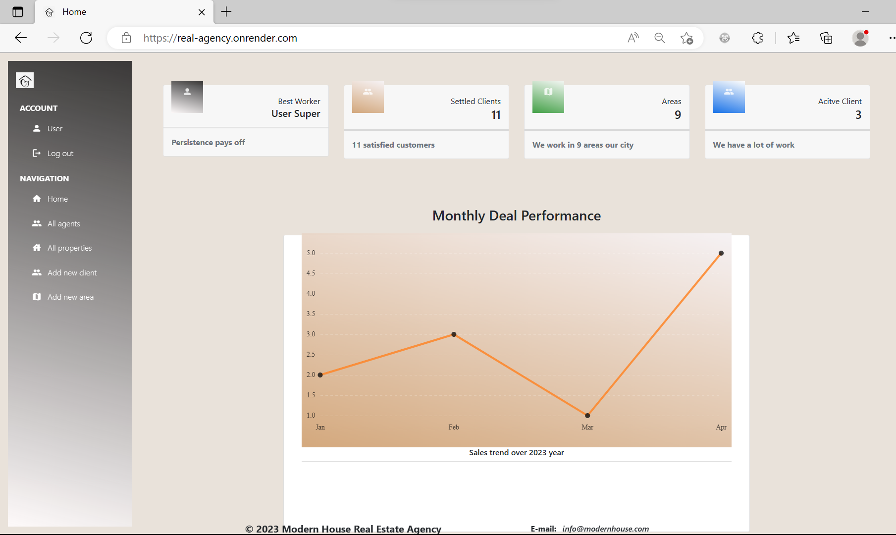
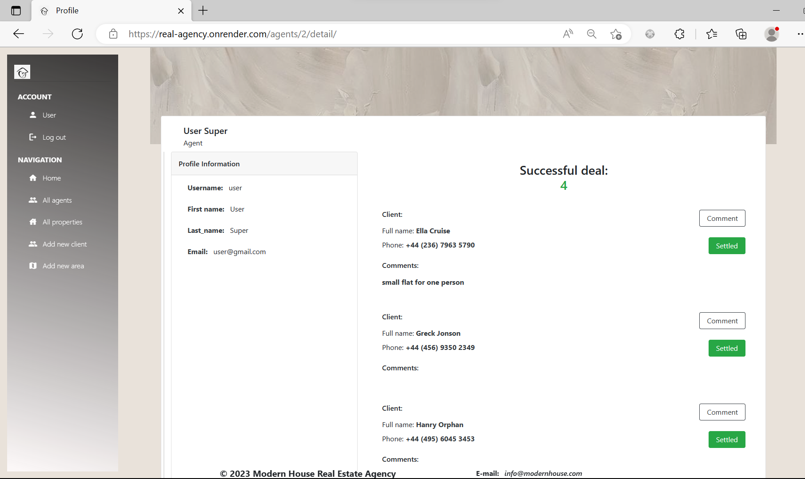
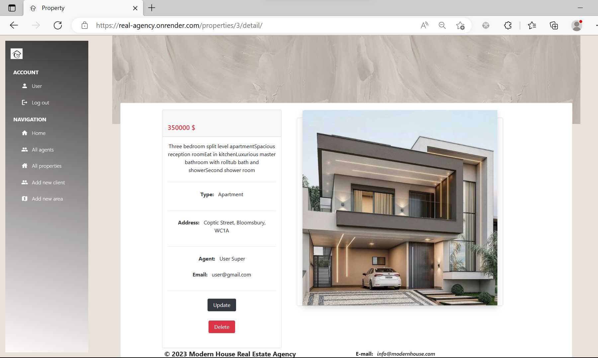

# Agent Resources Hub
The platform would allow agents to manage information about their properties and clients, and the platform could then generate reports on various metrics such as property sales

## Installation
To install the Agent Resources Hub, follow these steps:

1. Clone the repository:

```
git clone git clone git@github.com:viktoria-rybenchuk/real-estate-agency.git

```
2. Create and activate a virtual environment:

```
python -m venv venv
venv\Scripts\activate (on Windows)
source venv/bin/activate (on macOS/Linux)
```
3. Install the requirements:

```
pip install -r requirements.txt
```
4. Run database migrations:
```
python manage.py migrate
```
5. Start the server:
```
python manage.py runserver
```

## Environmental variables

* DJANGO_SECRET_KEY
* DATABASE_URL

## Features

* Property listing management: The platform could provide an easy-to-use interface for agents to add, update, and manage their property listings. 
* The platform could also include a feature to enable agents to view their own performance, to provide motivation and a benchmark for their own progress. 
* The search results could include detailed information about each property, such  descriptions, and contact information for the agent responsible for the property. 
* The platform could then generate a report that shows the overall sales results for each month, displayed in a graphical format such as a bar graph. This report could be accessible to both agents and managers, providing insight into overall performance and allowing for more informed decision-making.

## Website
[Real Estate Agency Website Link](https://real-agency.onrender.com/)

## Credentials

To access the system, you will need to enter login credentials:
```shell
Username: user
Password: user12345
```



